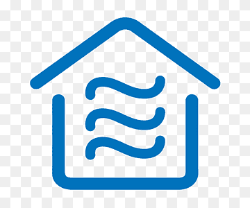
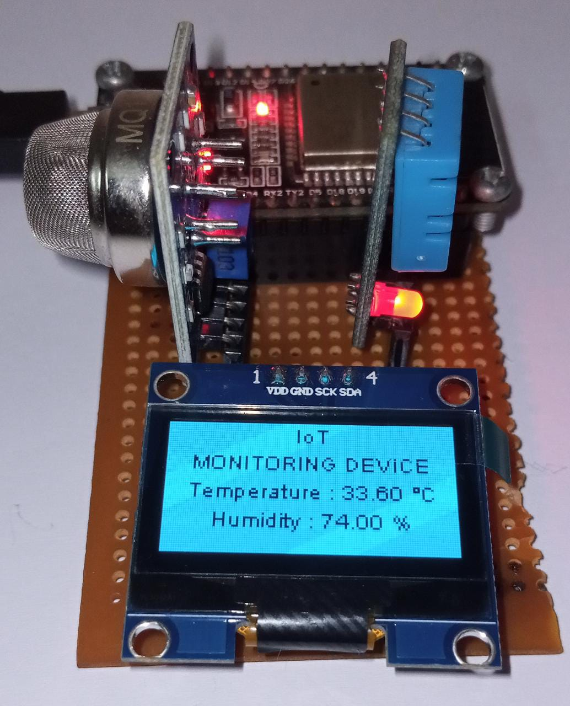

<div id="top"></div>
<!--
*** Thanks for checking out the Best-README-Template. If you have a suggestion
*** that would make this better, please fork the repo and create a pull request
*** or simply open an issue with the tag "enhancement".
*** Don't forget to give the project a star!
*** Thanks again! Now go create something AMAZING! :D
-->


<!-- PROJECT SHIELDS -->
<!--
*** I'm using markdown "reference style" links for readability.
*** Reference links are enclosed in brackets [ ] instead of parentheses ( ).
*** See the bottom of this document for the declaration of the reference variables
*** for contributors-url, forks-url, etc. This is an optional, concise syntax you may use.
*** https://www.markdownguide.org/basic-syntax/#reference-style-links
-->
[![Contributors][contributors-shield]][contributors-url]
[![Forks][forks-shield]][forks-url]
[![Stargazers][stars-shield]][stars-url]
[![Issues][issues-shield]][issues-url]
[![MIT License][license-shield]][license-url]
[![LinkedIn][linkedin-shield]][linkedin-url]


<!-- PROJECT LOGO -->
<br />
<div align="center">
  <a href="https://github.com/maaz-siddiqui/ESP32_MQ-135_SH1106">
    
  </a>

  <h3 align="center">Air-Quality Monitoring</h3>

  <p align="center">
    Air Quality Monitoring Using MQ135 Sensor and DHT-11.
    <br />
    <a href="https://components101.com/sensors/mq135-gas-sensor-for-air-quality"><strong>Explore the docs »</strong></a>
    <br />
    <br />
    <!-- <a href="https://github.com/othneildrew/Best-README-Template">View Demo</a>
    ·
    <a href="https://github.com/othneildrew/Best-README-Template/issues">Report Bug</a>
    ·
    <a href="https://github.com/othneildrew/Best-README-Template/issues">Request Feature</a>-->
  </p>
</div>


<!-- TABLE OF CONTENTS -->
<details>
  <summary>Table of Contents</summary>
  <ol>
    <li>
      <a href="#about-the-project">About The Project</a>
      <ul>
        <li><a href="#built-with">Built With</a></li>
      </ul>
    </li>
    <li>
      <a href="#getting-started">Getting Started</a>
      <ul>
        <li><a href="#installation">Installation</a></li>
      </ul>
    </li>
    <li><a href="#contributing">Contributing</a></li>
    <li><a href="#license">License</a></li>
    <li><a href="#contact">Contact</a></li>
  </ol>
</details>


<!-- ABOUT THE PROJECT -->
## About The Project



Air Quality monitoring system using ESP32. Diplsay used is OLED Display with Air Quality Sensor MQ135 and DHT-11.

Monitors :
* Carbon Dioxide CO2
* Ammonia NH4
* Alcohol


<p align="right">(<a href="#top">back to top</a>)</p>


### Built With

This section should list components required to get started:

Software

* [![Arduino][Arduino IDE]][arduino-url]

Hardware

* ESP32 Dev Module
* MQ-135 Module
* SH1106 OLED i2c 128x64
* DHT-11 Module

<p align="right">(<a href="#top">back to top</a>)</p>


<!-- GETTING STARTED -->
## Getting Started

Install libraries provided manually as MQunifiedsensor library is modified. Set pin A0 of MQ135 to ADC pin of ESP32. Setup SH1106 pin of SDA SCL with ESP32 SDA SCL. Select appropriate board and port.


### Installation

Use the Library manager to install : 

```c
#include <MQUnifiedsensor.h>
#include "SH1106Wire.h"
#include <Wire.h>
```

### Setup

```c
#define board ("ESP-32")
#define Voltage_Resolution 3.3
#define pin 15 //Analog input 0 of your arduino
#define type "MQ-135" //MQ135
#define ADC_Bit_Resolution 12 // For arduino UNO/MEGA/NANO
#define RatioMQ135CleanAir 3.6//RS / R0 = 3.6 ppm  
```

### Contributing
Pull requests are welcome. For major changes, please open an issue first to discuss what you would like to change.
Please make sure to update tests as appropriate.

<!-- LICENSE -->
### License

Distributed under the MIT License. See `LICENSE.txt` for more information.

<p align="right">(<a href="#top">back to top</a>)</p>


<!-- CONTACT -->
### Contact

Maaz Siddiqui - maaz.siddiqui3073@gmail.com

Project Link: [ESP32_MQ-135_SH1106](https://github.com/maaz-siddiqui/ESP32_MQ-135_SH1106)

<p align="right">(<a href="#top">back to top</a>)</p>


<!-- MARKDOWN LINKS & IMAGES -->
<!-- https://www.markdownguide.org/basic-syntax/#reference-style-links -->
[contributors-shield]: https://img.shields.io/github/contributors/maaz-siddiqui/ESP32_MQ-135_SH1106.svg?style=for-the-badge
[contributors-url]: https://github.com/maaz-siddiqui/ESP32_MQ-135_Sh1106/graphs/contributors
[forks-shield]: https://img.shields.io/github/forks/maaz-siddiqui/ESP32_MQ-135_SH1106.svg?style=for-the-badge
[forks-url]: https://github.com/maaz-siddiqui/ESP32_MQ-135_Sh1106/network/members
[stars-shield]: https://img.shields.io/github/stars/maaz-siddiqui/ESP32_MQ-135_SH1106.svg?style=for-the-badge
[stars-url]: https://github.com/maaz-siddiqui/ESP32_MQ-135_Sh1106/stargazers
[issues-shield]: https://img.shields.io/github/issues/maaz-siddiqui/ESP32_MQ-135_SH1106.svg?style=for-the-badge
[issues-url]: https://github.com/maaz-siddiqui/ESP32_MQ-135_Sh1106/issues
[license-shield]: https://img.shields.io/github/license/maaz-siddiqui/ESP32_MQ-135_Sh1106.svg?style=for-the-badge
[license-url]: https://github.com/maaz-siddiqui/ESP32_MQ-135_Sh1106/blob/master/LICENSE.txt

[linkedin-shield]: https://img.shields.io/badge/-LinkedIn-black.svg?style=for-the-badge&logo=linkedin&colorB=555
[linkedin-url]: https://linkedin.com/in/siddiqui-maaz
[Arduino IDE]: https://img.shields.io/badge/Arduino-00979D?style=for-the-badge&logo=arduino&logoColor=white
[arduino-url]: https://www.arduino.cc/en/software